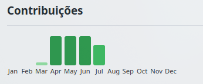

# 🛠️ GitHub Dashboard Framework

A full-stack application built with **JavaScript** and **Express** that displays GitHub user statistics in a dynamic frontend dashboard. It includes:

- 🌐 Backend server to fetch and format GitHub API data
- 🎨 Frontend to visualize profile, repositories, contributions, and more

---

## 📸 Project Visualizations


*perfil user*


*most used languages*


*monthly contribution*


*repositories*


---

## 🔙 Backend - GitHub API Explorer Server

### Technologies
- Express.js
- Custom service classes (`UserService`, `RepoService`, etc.)
- GitHub REST API

### Features
- Serves frontend dashboard via `index.html`
- API endpoint `/api/github-data` that returns:
  - User profile
  - Repositories
  - Recent activities
  - Language usage
  - Commits
  - Monthly contributions

### Highlights

```js
// Main data route
app.get('/api/github-data', asyncHandler(async (req, res) => {
  // Load all services
  const services = {
    user: new UserService(config),
    repo: new RepoService(config),
    activity: new ActivityService(config),
    language: new LanguageService(config),
    commit: new CommitService(config),
    contribution: new ContributionService(config)
  };

  await Promise.all([
    services.user.loadUserData(),
    services.repo.loadReposData(),
    services.activity.loadActivities(),
    services.contribution.loadContributionsData()
  ]);

  await services.language.loadLanguagesData(services.repo.reposData);
  await services.commit.loadCommitsData(services.repo.reposData);

  res.json({ ...formattedResults });
}));