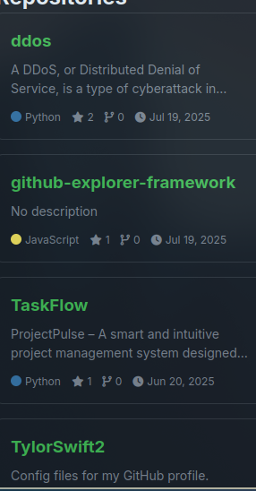

# 🚀 GitHub Dashboard Framework

<div style="
    font-family: 'Segoe UI', Tahoma, Geneva, Verdana, sans-serif;
    max-width: 900px;
    margin: 0 auto;
    color: #24292e;
">

<div style="
    background: linear-gradient(135deg, #f6f8fa 0%, #e1e4e8 100%);
    padding: 2rem;
    border-radius: 12px;
    box-shadow: 0 4px 12px rgba(0,0,0,0.1);
">

## 🌈 Project Overview

A full-stack dashboard that visualizes GitHub profile data with:

<div style="
    display: grid;
    grid-template-columns: repeat(auto-fit, minmax(250px, 1fr));
    gap: 1rem;
    margin: 1.5rem 0;
">
    <div style="
        background: white;
        padding: 1rem;
        border-radius: 8px;
        box-shadow: 0 2px 8px rgba(0,0,0,0.05);
    ">
        <h3>👤 User Profile</h3>
        <p>Avatar, bio, followers, and more</p>
    </div>
    <div style="
        background: white;
        padding: 1rem;
        border-radius: 8px;
        box-shadow: 0 2px 8px rgba(0,0,0,0.05);
    ">
        <h3>📚 Repositories</h3>
        <p>Sorted by stars with key metrics</p>
    </div>
    <div style="
        background: white;
        padding: 1rem;
        border-radius: 8px;
        box-shadow: 0 2px 8px rgba(0,0,0,0.05);
    ">
        <h3>💬 Activity Feed</h3>
        <p>Recent GitHub events timeline</p>
    </div>
</div>

## 🖼️ Live Preview

<div style="
    display: flex;
    gap: 1rem;
    overflow-x: auto;
    padding: 1rem 0;
    margin: 1.5rem 0;
">
    
    
    
</div>

## 🛠️ Tech Stack

<div style="
    background: white;
    padding: 1.5rem;
    border-radius: 8px;
    margin: 1.5rem 0;
    box-shadow: 0 2px 8px rgba(0,0,0,0.05);
">
    <div style="display: flex; gap: 1rem; flex-wrap: wrap;">
        <div style="
            background: #f6f8fa;
            padding: 0.5rem 1rem;
            border-radius: 20px;
            font-weight: bold;
        ">JavaScript</div>
        <div style="
            background: #f6f8fa;
            padding: 0.5rem 1rem;
            border-radius: 20px;
            font-weight: bold;
        ">Express.js</div>
        <div style="
            background: #f6f8fa;
            padding: 0.5rem 1rem;
            border-radius: 20px;
            font-weight: bold;
        ">GitHub API</div>
        <div style="
            background: #f6f8fa;
            padding: 0.5rem 1rem;
            border-radius: 20px;
            font-weight: bold;
        ">CSS3</div>
    </div>
</div>

## ⚡ Quick Start

```bash
# Clone the repository
git clone https://github.com/yourusername/github-dashboard.git

# Install dependencies
npm install

# Configure environment variables
echo "GITHUB_USERNAME=yourusername" > .env
echo "GITHUB_TOKEN=yourtoken" >> .env

# Start the server
npm start